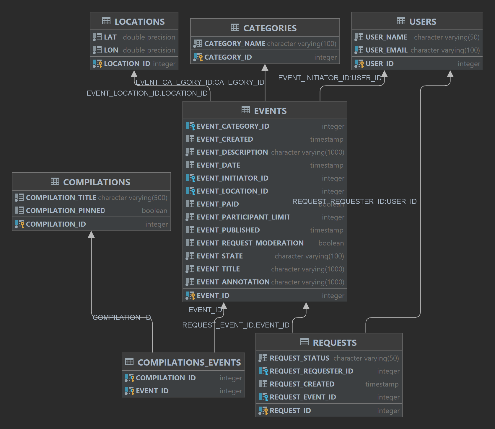
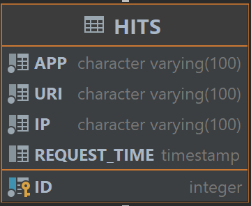

# java-explore-with-me
Template repository for ExploreWithMe project.
[Ссылка на pullrequest](https://github.com/ince92/java-explore-with-me/pull/1)

Приложение ExploreWithMe дает возможность делиться информацией об интересных событиях 
и помогает найти компанию для участия в них. Это приложение — афиша, где можно предложить 
какое-либо событие от выставки до похода в кино и набрать компанию для участия в нём.
Оно состоит из трех модулей - main, client и stat. 
Основной модуль main содержит все необходимое для работы приложения. Он разделен на три 
части:  
- публичная, доступна без регистрации любому пользователю сети. 
- закрытая, доступна только авторизованным пользователям. 
- административная, для администраторов сервиса. 
Структура базы данных основного модуля:

Модуль stat выполняет функцию сбора информации. Во-первых, о количестве обращений пользователей 
к спискам событий и, во-вторых, о количестве запросов к подробной информации о событии. 
На основе этой информации должна формироваться статистика о работе приложения.
Структура базы данных модуля статистики:

Третий модуль client связывает основной модуль с модулем статистики.
